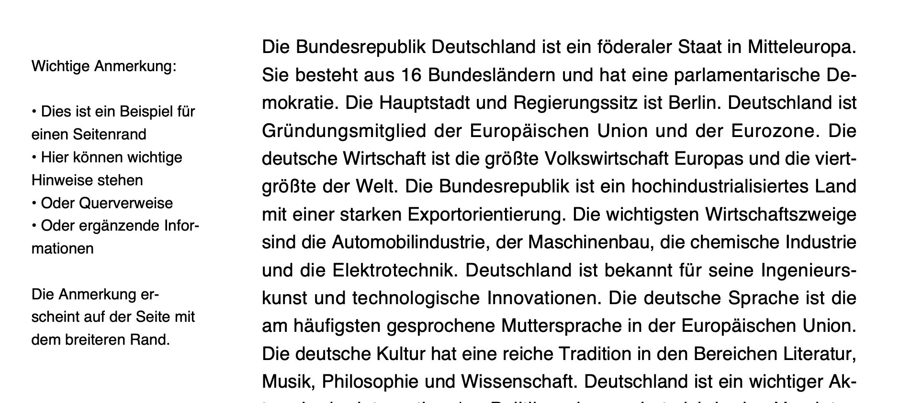

# PDF Generator

A Kotlin application that demonstrates PDF generation using different libraries (Flying Saucer, OpenPDF, and iText 7).

Examples should demonstrate the expected quality and supported features of various libraries.

## Feature Comparison

The following table compares the key features supported by each PDF generation library:

| Feature | Flying Saucer | OpenPDF | iText 7 |
|---------|--------------|---------|---------|
| Multi-column layout | ✅ | ✅ | ✅ |
| Margin texts | ✅ | ✅ | ✅ |
| Pagedependent layouts | ❌ | ✅ | ✅ |
| Hyphenation | ✅ | ✅/❌ | ✅ |
| Justified text | ✅ | ❌ | ✅ |
| Customizability | ⭐⭐ | ⭐⭐⭐ | ⭐⭐⭐⭐ |

Legend:
- ✅: Fully supported
- ❌: Not supported supported
- ✅/❌: Somewhat supported
- ⭐: Level of support (1-4 stars)

Notes:
- Flying Saucer excels at HTML to PDF conversion with good support for modern web features and high quality output (e.g. anti-aliased text and)
- OpenPDF is quite bad at layouting justified text. It allows for customizations similar to iText but with a smaller base-feature set
- iText 7 offers an okay feature set with customization options but has a AGPL or commercial license. If you want to have a specific style you probably will have to put some effort into making it work.

**iText example**


## Building

The project uses Gradle for building. To build the project:

```bash
./gradlew build
```

This will create a JAR file in `build/libs/`.

## Running

### Using Gradle

You can run the application directly using Gradle:

```bash
# Generate PDF using Flying Saucer
./gradlew run --args="flyingsaucer"

# Generate HTML using Flying Saucer
./gradlew run --args="flyingsaucer --html"

# Generate PDF using OpenPDF
./gradlew run --args="openpdf"

# Generate PDF using iText 7
./gradlew run --args="itext"

# Generate PDFs using all libraries
./gradlew run --args="all"

# Specify output path
./gradlew run --args="flyingsaucer -o /tmp/my-pdf"

# Disable automatic opening
./gradlew run --args="openpdf --no-open"
```

### Using the JAR file

After building, you can run the JAR file directly:

```bash
# Generate PDF using Flying Saucer
java -jar build/libs/pdf-generator.jar flyingsaucer

# Generate HTML using Flying Saucer
java -jar build/libs/pdf-generator.jar flyingsaucer --html

# Generate PDF using OpenPDF
java -jar build/libs/pdf-generator.jar openpdf

# Generate PDF using iText 7
java -jar build/libs/pdf-generator.jar itext

# Generate PDFs using all libraries
java -jar build/libs/pdf-generator.jar all

# Specify output path
java -jar build/libs/pdf-generator.jar flyingsaucer -o /tmp/my-pdf

# Disable automatic opening
java -jar build/libs/pdf-generator.jar openpdf --no-open
```

## Command Line Options

- `flyingsaucer`: Generate PDF using Flying Saucer
- `openpdf`: Generate PDF using OpenPDF
- `itext`: Generate PDF using iText 7
- `all`: Generate PDFs using all libraries
- `-o, --output <path>`: Specify output file path (without extension)
- `--no-open`: Don't automatically open the generated PDF
- `--html`: Generate HTML instead of PDF (only for flyingsaucer command)

## Dependencies

- Flying Saucer (for HTML to PDF conversion)
- OpenPDF (for programmatic PDF generation)
- iText 7 (for programmatic PDF generation)
- Kotlin standard library 